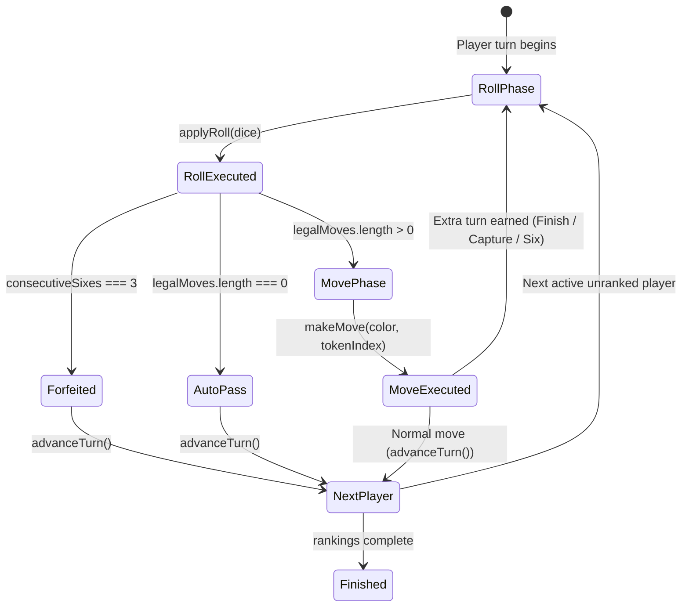

# Semester Library Games Platform — Ludo Engine Architecture (Phase 1.5 Canonical)

## 1. Overview & Architectural Philosophy

The **Semester Library Ludo Engine** (`@semester-library/ludo-engine`) is an authoritative, deterministic, headless rules engine and offline bot controller for the Semester Library Games platform.

### Core Architecture Principles
1. **Single Canonical Implementation**: Located at `packages/ludo-engine/`. Shared across:
   - **Online Cloudflare Workers / Durable Objects**: Authoritative server validation, room state management, server RNG.
   - **Offline / Local Mobile Controller**: Pass-and-play, local practice vs bots, zero network dependency.
   - **Node.js Automated Test Suites**: Comprehensive rule verification, invariant checking, property simulations.
2. **Zero Platform Dependencies**: Pure TypeScript standard library (ES2022). No Node-only dependencies (`fs`, `crypto`, `path`), no Cloudflare-only dependencies (`@cloudflare/workers-types`), and no React Native / UI dependencies (`react`, `react-native`, `StyleSheet`).
3. **No Production Symlinks or Code Duplication**:
   - Packaged as a clean workspace package (`packages/ludo-engine`).
   - Metro bundler resolves `@semester-library/ludo-engine` via `watchFolders` and `resolver.extraNodeModules` in `mobile/metro.config.js`.
   - Cloudflare Worker backend resolves it via TypeScript path mapping and canonical re-export at `games-backend/src/games/ludo/index.ts`.
4. **Strict Logical Progress Model**: Tokens do not use screen pixels or ad-hoc indices. They use a linear mathematical progress coordinate system (`-1..56`) mapped to a canonical 52-cell track, 5-cell private home stretches, and final central goal.
5. **Deterministic & Injectable RNG**: Dice rolling is decoupled from engine state transitions via an injectable `DiceRoller` / `RngFn` interface.
6. **Robust State Serialization**: All states are pure JSON data structures (`number`, `string`, `boolean`, `null`, plain arrays and objects). No `Date`, functions, symbols, or class instances in state.

---

## 2. Canonical Package Architecture & Consumer Resolution

```
semester-library/
├── packages/
│   └── ludo-engine/                      <-- CANONICAL ENGINE SOURCE
│       ├── package.json                  (@semester-library/ludo-engine)
│       ├── tsconfig.json
│       └── src/
│           ├── index.ts                  (Public API barrel export)
│           ├── types.ts                  (Core types, states, moves)
│           ├── board.ts                  (52-cell geometry, 15x15 logical grid)
│           ├── validator.ts              (Cross-field invariant validation)
│           ├── engine.ts                 (Authoritative Ludo rules engine)
│           └── bot.ts                    (Easy / Normal / Hard heuristic bots)
├── games-backend/
│   ├── tsconfig.json                     (Path alias: @semester-library/ludo-engine)
│   └── src/games/ludo/
│       └── index.ts                      (Re-exports canonical engine for Wrangler)
└── mobile/
    ├── tsconfig.json                     (Path alias: @semester-library/ludo-engine)
    └── metro.config.js                   (watchFolders & extraNodeModules resolution)
```

### How Consumers Resolve the Canonical Engine:
- **Mobile Expo / Metro Bundler**:
  `mobile/metro.config.js` configures:
  ```js
  config.watchFolders = [path.resolve(__dirname, '..', 'packages', 'ludo-engine')];
  config.resolver.extraNodeModules = {
    '@semester-library/ludo-engine': path.resolve(__dirname, '..', 'packages', 'ludo-engine', 'src'),
  };
  ```
  This allows Expo/Metro to compile TypeScript directly without requiring a pre-build step or fragile symlinks.
- **Cloudflare Worker (Wrangler)**:
  `games-backend/src/games/ludo/index.ts` re-exports everything from `../../../../packages/ludo-engine/src/index.ts`. Wrangler bundles this during deployment without issues.
- **Node Test Runner**:
  Node 24 `--test` natively resolves and runs TypeScript test files directly against the shared package.

---

## 3. Route Geometry & Progress Coordinate Proof

The board consists of a shared outer track of **52 squares** indexed `0..51` clockwise, 4 colored yards (Home), 4 private 5-square Home Stretches, and 1 Central Finish.

### Quadrants & Color Start Offsets
Turn rotation and quadrants are strictly clockwise:
`red` (top-left) $\rightarrow$ `green` (top-right) $\rightarrow$ `yellow` (bottom-right) $\rightarrow$ `blue` (bottom-left)

- **Red Start**: Track Cell `0`
- **Green Start**: Track Cell `13`
- **Yellow Start**: Track Cell `26`
- **Blue Start**: Track Cell `39`

### Mathematical Progress Model (`-1 .. 56`)
Each active player controls 4 tokens (`tokenIndex: 0, 1, 2, 3`). Each token has a single integer progress coordinate in `[-1, 56]`:

| Progress Range | Phase | Description | Canonical Board Position |
|---|---|---|---|
| `-1` | **HOME** | In Yard waiting to deploy | `{ type: 'home', color, tokenIndex }` |
| `0` | **START** | Spawned on color start cell | `{ type: 'track', trackIndex: START_OFFSETS[c], isSafe: true }` |
| `1 .. 50` | **TRACK** | Traversing shared outer track | `{ type: 'track', trackIndex: (start + p) % 52, isSafe }` |
| `51 .. 55` | **HOME STRETCH** | Private colored column (0..4) | `{ type: 'stretch', color, stretchIndex: p - 51 }` |
| `56` | **FINISHED** | Central Home / Goal reached | `{ type: 'finish', color }` |

### Route & Transition Proof for All Four Colors

Formula for track index from progress:
$$\text{trackIndex} = (\text{START\_OFFSETS}[\text{color}] + \text{progress}) \pmod{52}$$

1. **Red**:
   - Spawn square: `trackIndex = (0 + 0) % 52 = 0` (Red Start)
   - Traversal: cells `0 .. 50` (51 total track cells)
   - Final shared-track cell: `progress = 50` $\rightarrow$ `trackIndex = (0 + 50) % 52 = 50`
   - Home stretch entry: at `progress = 51`, transitions to Red stretch index 0
   - Private stretch: `progress 51..55` $\rightarrow$ stretch indices `0..4`
   - Finish: exact roll to `progress = 56`
2. **Green**:
   - Spawn square: `trackIndex = (13 + 0) % 52 = 13` (Green Start)
   - Traversal: cells `13..51` then wrap `0..11` (51 total track cells)
   - Final shared-track cell: `progress = 50` $\rightarrow$ `trackIndex = (13 + 50) % 52 = 11`
   - Home stretch entry: at `progress = 51`, transitions to Green stretch index 0
   - Private stretch: `progress 51..55` $\rightarrow$ stretch indices `0..4`
   - Finish: exact roll to `progress = 56`
3. **Yellow**:
   - Spawn square: `trackIndex = (26 + 0) % 52 = 26` (Yellow Start)
   - Traversal: cells `26..51` then wrap `0..24` (51 total track cells)
   - Final shared-track cell: `progress = 50` $\rightarrow$ `trackIndex = (26 + 50) % 52 = 24`
   - Home stretch entry: at `progress = 51`, transitions to Yellow stretch index 0
   - Private stretch: `progress 51..55` $\rightarrow$ stretch indices `0..4`
   - Finish: exact roll to `progress = 56`
4. **Blue**:
   - Spawn square: `trackIndex = (39 + 0) % 52 = 39` (Blue Start)
   - Traversal: cells `39..51` then wrap `0..37` (51 total track cells)
   - Final shared-track cell: `progress = 50` $\rightarrow$ `trackIndex = (39 + 50) % 52 = 37`
   - Home stretch entry: at `progress = 51`, transitions to Blue stretch index 0
   - Private stretch: `progress 51..55` $\rightarrow$ stretch indices `0..4`
   - Finish: exact roll to `progress = 56`

### Correctness Guarantees:
- **No cell skipped**: Each token visits exactly 51 shared track cells (0 to 50 inclusive).
- **Own start not traversed twice**: A token starts at progress 0, moves around 50 steps, and turns into its home stretch before reaching its start square again (`(start + 52) % 52 == start`, but maximum track progress is 50).
- **Opponent stretches isolated**: Home stretch transitions occur exclusively from a token's private entry square directly into its color's private stretch array.
- **Total distance to finish**: Exactly 56 steps from start square (`progress 0`) to goal (`progress 56`).

---

## 4. 15x15 Logical Board Grid Mapping

`board.ts` provides `getLogicalGridCoordinates(pos: CanonicalBoardPosition)` mapping every logical board position to standard 15x15 grid coordinates (`x: 0..14, y: 0..14`):

- **Red Yard (Top-Left)**: Tokens at `(2, 2)`, `(3, 2)`, `(2, 3)`, `(3, 3)`.
- **Green Yard (Top-Right)**: Tokens at `(11, 2)`, `(12, 2)`, `(11, 3)`, `(12, 3)`.
- **Yellow Yard (Bottom-Right)**: Tokens at `(11, 11)`, `(12, 11)`, `(11, 12)`, `(12, 12)`.
- **Blue Yard (Bottom-Left)**: Tokens at `(2, 11)`, `(3, 11)`, `(2, 12)`, `(3, 12)`.
- **Track Cells (0..51)**: Form a single continuous non-overlapping 52-cell perimeter loop:
  - Track 0 (Red Start): `(1, 6)`
  - Track 11 (Green Entry): `(7, 0)` $\rightarrow$ Green stretch 0: `(7, 1)`
  - Track 13 (Green Start): `(8, 1)`
  - Track 24 (Yellow Entry): `(14, 7)` $\rightarrow$ Yellow stretch 0: `(13, 7)`
  - Track 26 (Yellow Start): `(13, 8)`
  - Track 37 (Blue Entry): `(7, 14)` $\rightarrow$ Blue stretch 0: `(7, 13)`
  - Track 39 (Blue Start): `(6, 13)`
  - Track 50 (Red Entry): `(0, 7)` $\rightarrow$ Red stretch 0: `(1, 7)`
- **Center Finish Goals**:
  - Red Goal: `(6, 7)`
  - Green Goal: `(7, 6)`
  - Yellow Goal: `(8, 7)`
  - Blue Goal: `(7, 8)`

### Spatial Contiguity & Topology Invariants
- **Adjacency Invariant**: Every consecutive pair of outer track cells ($i \to (i+1) \pmod{52}$) maps to a physically adjacent board cell in the 8-connected Moore neighborhood ($\text{Chebyshev distance} = \max(|\Delta x|, |\Delta y|) = 1$).
- **Orthogonal Steps (48 pairs)**: Exactly 48 pairs have $\text{Manhattan distance} = 1$ ($\Delta x + \Delta y = 1$).
- **Diagonal Inner Reflex Corners (4 pairs)**: Exactly 4 pairs have $\text{Manhattan distance} = 2$ and $\text{Chebyshev distance} = 1$ ($\Delta x = 1, \Delta y = 1$):
  1. `4 -> 5`: Left Arm to Top Arm inner corner (`(5, 6) -> (6, 5)`)
  2. `17 -> 18`: Top Arm to Right Arm inner corner (`(8, 5) -> (9, 6)`)
  3. `30 -> 31`: Right Arm to Bottom Arm inner corner (`(9, 8) -> (8, 9)`)
  4. `43 -> 44`: Bottom Arm to Left Arm inner corner (`(6, 9) -> (5, 8)`)
- **No Skipped Cells**: There are no physical squares between these corners (they touch at the cross junction). No cell is skipped, and no teleportation occurs.
- **Animation Path Helpers**:
  - `getTraversedPositions(color, fromProgress, toProgress)`: Returns the exact array of `CanonicalBoardPosition` waypoints traversed step-by-step.
  - `getTraversedCoordinates(color, fromProgress, toProgress)`: Maps traversed positions to sequential `{ x, y }` 15x15 grid coordinates for hop-by-hop piece animations.

---

## 5. Safe Cells Model

There are **8 canonical safe cells** on the shared 52-cell track:
```ts
export const SAFE_TRACK_CELLS = [0, 8, 13, 21, 26, 34, 39, 47];
```

### Why Each Safe Cell is Safe:
1. **Spawn / Start Squares (`0, 13, 26, 39`)**:
   - `0`: Red Spawn. Protects newly spawned Red tokens and ensures safe passage across the top arm.
   - `13`: Green Spawn. Protects newly spawned Green tokens.
   - `26`: Yellow Spawn. Protects newly spawned Yellow tokens.
   - `39`: Blue Spawn. Protects newly spawned Blue tokens.
2. **Symmetrical Star / Globe Squares (`8, 21, 34, 47`)**:
   - Positioned exactly 8 cells after each color's start square (`start + 8`).
   - Acts as an intermediate safe resting point along the long outer arm.
3. **Capture Immunity**:
   - Tokens resting on these cells cannot be captured.
   - Immediately adjacent cells (e.g. 1, 7, 9, 12, 14, etc.) are standard non-safe cells and fully capturable.
   - Safe-cell protection holds identically before and after track wrapping (`trackIndex >= 52`).

---

## 6. Multiple Tokens & Capture Rules (Semester Library V1)

### V1 Policy:
- **No Blockade Rule**: Semester Library Ludo V1 deliberately does NOT implement blockades. Any number of tokens may pass through or land on occupied squares.
- **Coexistence**: Multiple tokens of the same color may share any square (safe or non-safe). Multiple tokens of different colors may share safe squares.
- **Multi-Token Capture Rule**:
  - If a player lands on a **NON-SAFE** track square occupied by one or more opponent tokens, **ALL enemy tokens on that square are captured** and returned to their respective yards (`progress = -1`).
  - The capturing player is awarded an extra turn.
  - If an opponent lands on a **SAFE** track square occupied by enemy tokens, no capture occurs. All tokens coexist peacefully.

---

## 7. Turn Lifecycle & Three-Consecutive-Sixes

### State Machine Lifecycle


### Three Consecutive Sixes
- Sequence: `6 -> move -> 6 -> move -> 6`
- **Result**: Upon rolling the **third consecutive six**, the player immediately forfeits their turn. No token move is allowed; the turn advances immediately to the next unranked player.
- **Sequence Preservation**: `consecutiveSixes` is tracked across dice rolls. If a player's first or second six results in a capture or finish, their `consecutiveSixes` count is **not** reset; rolling a subsequent six still increments toward 3.
- **Reset**: Rolling any non-six (`1..5`) immediately resets `consecutiveSixes` to 0.

---

## 8. Extra-Turn Precedence

A single token move may satisfy multiple extra-turn conditions simultaneously:
- A move with a rolled `6` that captures an opponent.
- A move with a rolled `6` that finishes a token.
- A move that captures and reaches a milestone.

### Rules Behavior:
- **Exactly One Extra Turn**: The engine awards exactly ONE extra roll. Extra turns never stack or queue.
- **Deterministic Metadata Precedence**:
  For animation and UI event display, `MoveResult.extraTurnReason` resolves using strict precedence:
  $$\text{finish} > \text{capture} > \text{six}$$
  - If a token finishes on a roll of 6: `extraTurnReason = 'finish'`
  - If a token captures on a roll of 6: `extraTurnReason = 'capture'`
  - If a token moves without capture or finish on a roll of 6: `extraTurnReason = 'six'`

---

## 9. Ranking & Match Termination

1. **Finishing Tokens**: When a player places their 4th token in the central goal (`progress = 56`), they are immediately added to `state.rankings`.
2. **Finishing Player Turn Termination**: Even if their final move was on a 6 or captured, a player whose 4th token just finished **never receives an extra turn**. Their turn immediately passes to the next unranked player.
3. **Automatic Final Ranking**:
   - In a 2-player match: when 1 player finishes, the remaining player is automatically awarded Rank 2, and the match concludes.
   - In a 3-player match: when 2 players finish, the remaining player is automatically awarded Rank 3, and the match concludes.
   - In a 4-player match: when 3 players finish, the remaining player is automatically awarded Rank 4, and the match concludes.
4. **Clean Match Finish**:
   - `state.status` transitions to `'finished'`.
   - `state.currentTurn` becomes `null`.
   - `state.phase` becomes `'roll'`.
   - `state.legalMoves` is emptied.

---

## 10. Bot Controller & Wrap-Around Threat Model

The bot controller (`packages/ludo-engine/src/bot.ts`) provides three difficulty tiers: `easy`, `normal`, and `hard`.

### Hard Bot Threat Model
The Hard bot calculates real tactical risks and opportunities using circular track distance:
$$\text{dist} = (\text{targetTrack} - \text{oppTrack} + 52) \pmod{52}$$

### Threat Bounds & Home Stretch Isolation:
1. **Valid Threat Range**: An opponent is only a threat if $1 \le \text{dist} \le 6$.
2. **Track Exit Bound**: An opponent is on their way to their own home stretch. If:
   $$\text{oppProgress} + \text{dist} > 50$$
   the opponent turns into their private home stretch before reaching `targetTrack`! The Hard bot recognizes this and does not falsely mark them as a threat.
3. **Home Stretch Absolute Safety**: Tokens inside private home stretches (`progress 51..55`) or at goal (`56`) are physically inaccessible to opponents. The bot never assesses threats or vulnerabilities for tokens inside the home stretch.

---

## 11. State Validation & Invariants

`validateLudoState(state)` enforces strict cross-field consistency:
1. Active players list must contain 2 to 4 unique valid colors.
2. All active players must have exactly 4 tokens with valid progress in `[-1, 56]`.
3. Rankings cannot contain duplicates, must only contain active players, and each ranked player must have all 4 tokens finished (`progress = 56`).
4. An unranked active player cannot already have all 4 tokens finished.
5. In `'playing'` status:
   - `currentTurn` must be an active, unranked player.
   - `consecutiveSixes` must be in `0..2`.
   - In `'roll'` phase: `currentRoll` must be `null`, and `legalMoves` must be empty.
   - In `'move'` phase: `currentRoll` must be in `1..6`, and every move in `legalMoves` must belong to `currentTurn`.
6. In `'finished'` status:
   - `currentTurn` must be `null`.
   - `rankings` must contain all active players.
7. Bot difficulty can only be set on players where `type === 'bot'`. Human players must never carry bot difficulty.

---

## 12. Serialization & Persistence Guarantees

- **Round-Trip Guarantee**:
  $$\text{state} \xrightarrow{\text{JSON.stringify}} \text{json} \xrightarrow{\text{JSON.parse}} \text{raw} \xrightarrow{\text{validateLudoState}} \text{validState} \xrightarrow{\text{LudoEngine.fromState}} \text{engine}$$
- **Zero Loss / Zero Drift**: State transitions are 100% deterministic, pure, and immutably reproducible.
